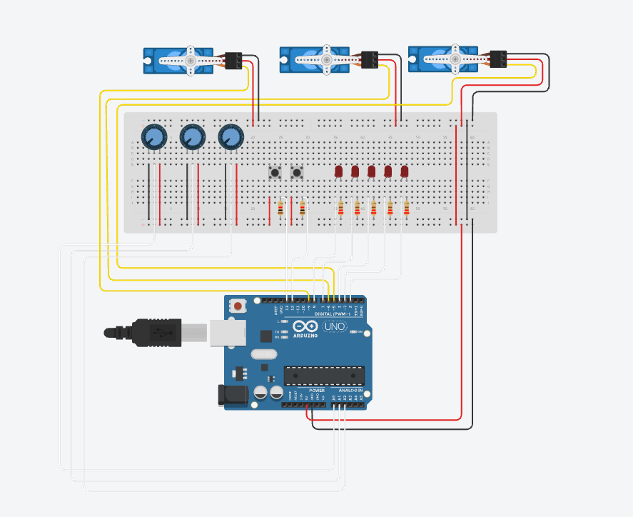

# Arduino_robot_arm
# Servo Memory Controller (Arduino / Tinkercad)

This repository contains a beginner-friendly, progressive implementation of a robotic arm controller based on the **Arduino Robotic Arm** concept originally shared by **MilesPeterson101** on Arduino Project Hub:

🔗 https://projecthub.arduino.cc/milespeterson101/arduino-robotic-arm-8b8601

👉 **Live Tinkercad project:**  
https://www.tinkercad.com/things/dZCJIFebCS4-arduinorobotarm

You can open the link to:
- view the full circuit
- inspect wiring
- run the simulation

This project is a beginner Arduino project that controls 3 servo motors using:
- potentiometers (manual control)
- buttons (save & play)
- LEDs (visual feedback)

---

## 📐 Circuit Diagrams

### Circuit View (Tinkercad)
This view shows the full breadboard-based wiring used in the simulation.

The code is developed step by step and tested in Tinkercad.

---

## 🧰 Hardware
- Arduino Uno  
- 3x Servo motors  
- 3x Potentiometers  
- 2x Push buttons  
- 5x LEDs + resistors  
- Breadboard & jumper wires  
- 1x Joystick (optional)

---

## 🔌 Pin Mapping

### Servos
| Servo   | Pin |
|--------|-----|
| Servo 1 | D5 |
| Servo 2 | D6 |
| Servo 3 | D9 |

### Potentiometers
| Pot   | Pin |
|------|-----|
| Pot 1 | A0 |
| Pot 2 | A1 |
| Pot 3 | A2 |

### Buttons
| Button | Pin |
|-------|-----|
| Save  | D12 |
| Play | D13 |

### LEDs
| LED  | Pin |
|------|-----|
| LED1 | D2 |
| LED2 | D3 |
| LED3 | D4 |
| LED4 | D7 |
| LED5 | D8 |

---

## 🗂 Code Structure
- `step1_servo_test.ino` → servo movement only  
- `step2_servo_led_test.ino` → servo + LED  
- `step3_button_test.ino` → button input test  
- `step4_full_memory_controller.ino` → full system  
- `step5_joystick_attached.ino` → replace two potentiometers with a joystick  

---

## 🎮 Joystick (Optional Upgrade)

In the final step of this project, two potentiometers are **replaced by a 2-axis joystick** to provide more intuitive directional control.

A joystick is electrically equivalent to **two potentiometers**:
- **X-axis (VRx)** → left / right movement  
- **Y-axis (VRy)** → up / down movement  

### What changes
- Potentiometer on **A0** → replaced by **Joystick VRx**
- Potentiometer on **A1** → replaced by **Joystick VRy**
- Potentiometer on **A2** is kept to control the third servo

Only **one analog input device is connected per pin**.

---

### Joystick Wiring

| Joystick Pin | Arduino Pin | Description |
|-------------|------------|-------------|
| VCC | 5V | Power |
| GND | GND | Ground |
| VRx | A0 | X-axis (replaces Pot 1) |
| VRy | A1 | Y-axis (replaces Pot 2) |
| SW | D11 | Joystick push button (optional) |

**Notes**
- The joystick shares **5V and GND** with other components.
- Do **not** connect a potentiometer and joystick axis to the same analog pin.
- The joystick switch (SW) is treated as a normal digital button.

---

### Joystick Behavior (in code)

- Joystick **X-axis** controls Servo 1  
- Joystick **Y-axis** controls Servo 2 or Servo 3 (mode switching via SW)  
- The joystick push button (SW) toggles control modes  
- Save and playback behavior remains unchanged  

This upgrade allows smoother and more intuitive control compared to individual potentiometers.

---

## ✅ Final Results

---

## 🎥 Demo Videos
- [▶ Demo 1](docs/video1.mp4)
- [▶ Demo 2](docs/video2.mp4)

---

## 🧪 Simulation
Tested using **Tinkercad Circuits**.  
https://www.tinkercad.com/things/dZCJIFebCS4-arduinorobotarm
